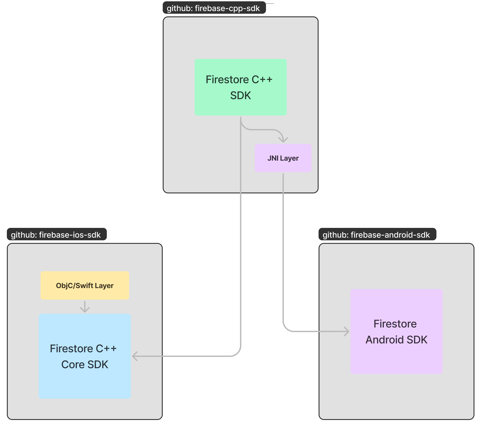

# Overview

This describes how to Firestore CPP SDK works on supported platforms, and how to
contribute this Firestore CPP SDK.

Please read `README.md` and `CONTRIBUTING.md` from the repository root first.

# Prerequisites

There is no specific prerequisites for Firestore, `README.md` from the root directory
should have everything you need.

One slight enhancement is to use [https://github.com/pyenv/pyenv][pyenv] to manage
your python versions, if you work on multiple projects with different python
requirements.

For CPP SDK to compile, you generally need your `pyenv which python` to point to
a Python3 installation.

# Architecture

It is easier to work this Firestore CPP SDK by keeping a high level architecture in mind:



To summarize, the C++ Code in this directory is an adapting layer on top of the underlying
SDKs: Firestore Android SDK for Android, and C++ Core SDK for everything else.

These dependencies live within different github repos, so understanding where and which versions
of the dependencies being used is critical to troubleshooting, should the issues stem from
those dependencies or the interop layer.

# Desktop building and testing

Desktop builds of the Firestore SDK uses `CMAKE` to build and test. The complete set
of tests lives under `${REPO_ROOT}/firestore/integration_test_internal`. To build
the Firestore CPP SDK and its test suites:

```shell
# from ${REPO_ROOT}/firestore/integration_test_internal
mkdir cmake-build-debug
cd cmake-build-debug

# Generate build files
cmake .. # Or OPENSSL_ROOT_DIR=${PATH_TO_OPENSSL} cmake ..
# Build SDK and tests
cmake --build . -j
```

Once above steps are successful, there should be a `integration_test` under the current directory:
```shell
./integration_test # Run all tests against Firestore Prod Backend

USE_FIRESTORE_EMULATOR=yes ./integration_test # Run all tests against Firestore Emulator

# Run all tests against Firestore Emulator on a custom port
USE_FIRESTORE_EMULATOR=yes FIRESTORE_EMULATOR_PORT=9999 ./integration_test 

./integration_test --gtest_filter="*Query*" # Run a subset of tests
```

It is also possible to change where we get the underlying C++ Core SDK living under
`firebase-ios-sdk` by providing a custom cmake flag `FIRESTORE_DEP_SOURCE`:
```shell
# Default behavior when not specified, getting the Core SDK the last C++ SDK release
# was released with.
cmake -DFIRESTORE_DEP_SOURCE=RELEASED ..

# Clones the origin/master branch of `firebase-ios-sdk` to get the Core SDK.
cmake -DFIRESTORE_DEP_SOURCE=TIP ..

# Clones the origin/master branch of `firebase-ios-sdk` to get the Core SDK.
cmake -DFIRESTORE_DEP_SOURCE=origin/master ..

# Clones commit '555555' of `firebase-ios-sdk`.
cmake -DFIRESTORE_DEP_SOURCE=555555 ..
```

## IDE Integration

Open up the repo root directory from `CLion` should load all symbols for the SDK itself.
Once loaded, you can right click on `firestore/integration_test_internal/CMakeLists.txt`
and `load project` to load the tests into the IDE.

# Android building and testing

Once Android NDK is installed and added to `local.properties` (should be same as the one
you use for Android SDK development), and `google-services.json`,
is added to `integration_test_internal`, it should be possible to build the testing
Android App directly with `gradlew`:

```shell
# from within integration_test_internal, build and install the testapp to an emulator or
# device
./gradlew installDebug

# Start the testapp
adb shell am start com.google.firebase.cpp.firestore.testapp/android.app.NativeActivity
```

**Note Firestore Emulator support is currently broken, it falls back to using Production Backend for now.**
It is also possible to run the testapp against Firestore emulator, as long as the testapp
is run from an Android Emulator and the Firestore emulator is running from the same
host OS:

```shell
# Start the testapp, but run against Firestore emulator
adb shell am start com.google.firebase.cpp.firestore.testapp/android.app.NativeActivity -e USE_FIRESTORE_EMULATOR true
```

## IDE Integration

It is possible to simply open up the `integration_test_internal` directory from `Android Studio`
directly, Android Studio will configure gradle and load all the tasks. Once configured, there
should be a `integration_test_internal` testapp you can start/debug from Android Studio.

In case when you cannot start the testapp from Android Studio, you can start it via `adb`:

```shell
# Start the testapp but wait for a debug to attach
adb shell am start -D -N com.google.firebase.cpp.firestore.testapp/android.app.NativeActivity
```

Then attach the debugger from Android Studio to unblock the testapp.


# iOS building and testing

When targting iOS, the SDK gets its dependency from Cocoapods, as opposed to from `cmake/external/firestore.cmake`.
The dependencies are specified with `ios_pod/Podfile`. Running cmake for iOS will download the pods
listed in this file, and add the C++ headers from the downloaded pods to include directories.

To build Firestore for iOS/tvOS:
```shell
# Build xcframeworks from this REPO, install pod dependencies and prepare xcworkspace
./prepare_xcworkspace.sh

# Open up the workspace
open integration_test.xcworkspace
```

NOTE: `prepare_xcworkspace.sh` changes `integration_test.xcodeproj/project.pbxproj`, to add the
build xcframeworks, these changes are not meant to be checked in, otherwise CI jobs will fail.

It should now be possible to run iOS tests in a simulator or a device from XCode.

To run the tests against a Firestore Emulator from an iOS simulator, set environment
variable `USE_FIRESTORE_EMULATOR` from XCode by:

1. Go to `Edit Scheme...` for target `integration_test`.
2. Add the environment variable like below:


## IDE Integration

IDE integration for iOS unfortunately is splitted between CLion and XCode. You can
do most of the development from CLion, with the same setup as desktop testing, and
use XCode for debugging only.
